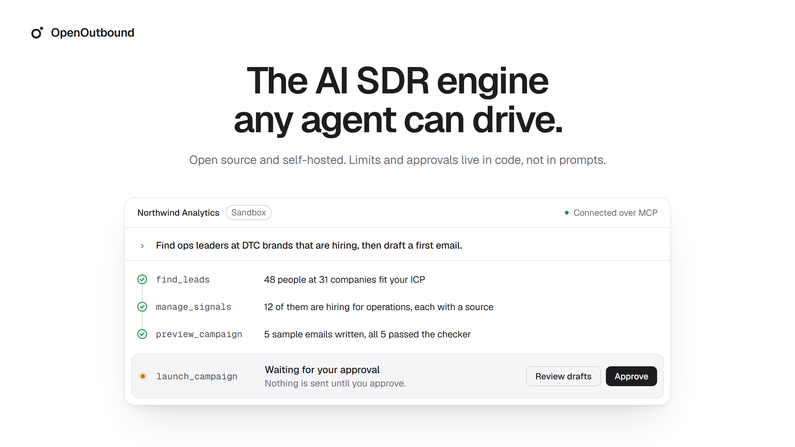
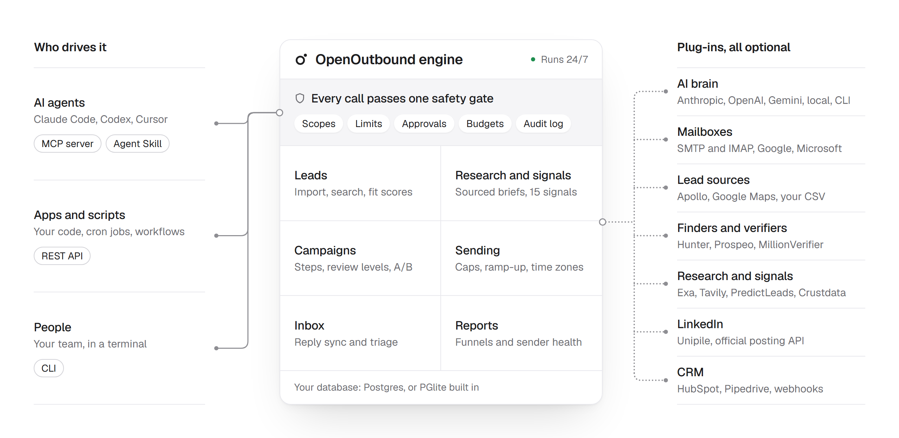

<p align="center">
  <picture>
    <source media="(prefers-color-scheme: dark)" srcset="assets/banner-dark.png">
    
  </picture>
</p>

<p align="center">
  Find leads, read buying signals, write and send email and LinkedIn outreach, handle replies and meetings, report results.<br>
  It runs 24/7 on its own. Your AI agent, your scripts or your team steer it.
</p>

<p align="center">
  <a href="LICENSE"></a>
  
  
  
</p>

<p align="center">
  <a href="#quickstart">Quickstart</a> ·
  <a href="docs/getting-started/connect-your-agent.md">Connect your agent</a> ·
  <a href="docs/README.md">Docs</a> ·
  <a href="docs/reference/mcp-tools.md">MCP tools</a> ·
  <a href="docs/roadmap.md">Roadmap</a>
</p>

---

## Why OpenOutbound

- **An engine, not a prompt.** Sending limits, approvals, suppression lists, compliance rules and budgets are enforced by code. An agent cannot blast 300 LinkedIn invites or email someone who unsubscribed, even if it tries. Retries, timeouts and crashes never send anything twice ([how](docs/concepts/delivery-guarantees.md)).
- **Any agent, any brain.** One registry powers an MCP server, an Agent Skill, a CLI and a REST API. Drive it from Claude, Codex, Cursor or a cron job. Think with Anthropic, OpenAI, OpenRouter, a local model, or your own Claude or ChatGPT subscription.
- **Every part is a plug-in.** Your mailboxes, your data providers, your LinkedIn provider, your CRM. Skip what you do not need; it still works with nothing but a CSV and one mailbox.

## Quickstart

Try it in the sandbox: two demo client workspaces with fake mailboxes, fake prospects and simulated replies. Nothing leaves your machine and no API keys are needed. You need Node 22 or 24, pnpm and git (on Node 25 and later, get pnpm with `npm install -g pnpm@11`).

```bash
git clone https://github.com/xyluxx/openoutbound && cd openoutbound
pnpm install && pnpm build
node dist/cli/main.js init       # .env with a fresh secret key, local database
node dist/cli/main.js sandbox    # seeds the demo workspaces
```

Start the server in a second terminal and leave it running, so the CLI and your agent share the local database:

```bash
node dist/cli/main.js serve
```

Connect your agent from the same folder (Claude Code shown; [Codex, Cursor, VS Code and others](docs/getting-started/connect-your-agent.md)). `init` prints this command with your paths filled in.

```bash
claude mcp add openoutbound -- node "$PWD/dist/cli/main.js" --home "$PWD" mcp --workspace northwind
```

Then ask it:

> What needs my attention in OpenOutbound? Then draft a campaign for our best offer and show me five sample emails before anything is sent.

What the agent asks to do waits for you: `node dist/cli/main.js approvals list --workspace northwind`. [The first hour](docs/getting-started/first-hour.md) walks through it step by step, and [Going live](docs/getting-started/going-live.md) lists what must be true before anything reaches a real person.

## How it works

<p align="center">
  <picture>
    <source media="(prefers-color-scheme: dark)" srcset="assets/how-it-works-dark.png">
    
  </picture>
</p>

The engine does the repetitive work on a schedule: sequencing, sending, reply sync, signal monitors, reports. Agents and people steer it through four doors. Every call passes the same safety gate: scopes, limits, approvals, budgets and an audit log with the reason for each action.

## What it does

| | |
|---|---|
| **Leads** | Import CSV, Excel or JSON, search Apollo or Google Maps, or hand over a list. Dedupe, ICP fit scoring with reasons, email finding and verification. |
| **Research and signals** | Sourced research briefs. 15 built-in buying signals plus your own, written in plain English. Free collectors for website changes, job boards, news and tech stack. |
| **Campaigns** | As many as you want, each with its own offer, senders, schedule, review level, writing rules and priority. Email and LinkedIn steps, waits, branches, A/B variants, templates. |
| **AI writing you can check** | Every fact about a prospect has a source. A checker reviews every message. Review every message, only first messages, or only when the checker is unsure. Preview on real leads and teach it with corrections. |
| **Sending** | Your own mailboxes over SMTP/IMAP or OAuth. Daily caps, ramp-up, recipient-timezone windows, one-click unsubscribe, bounce auto-pause, a daily DNS check. A send with no clear answer is looked up in the Sent folder, never blindly repeated. |
| **LinkedIn** | Profile visits, likes, comments, invites and messages inside conservative limits. Posting through LinkedIn's official API. |
| **Inbox** | Replies from every channel in one place, classified, with the right next step and drafted answers. Unsubscribes, privacy requests, angry replies and prompt-injection attempts are handled by locked rules. Answer a lead yourself from the mailbox and the engine steps back from that thread at its next sync; on LinkedIn, hand a conversation over with `reply_to_thread` action `take_over`. |
| **Meetings** | Replies offer your booking link, and Calendly, Cal.com or any booking tool reports bookings back, matched to the right lead. The engine never confirms a time itself. Held, no-show and qualified meetings are counted. |
| **Lead file** | What each lead told you, with its source, reaches the next email in any campaign. Notes, promises to keep and holds on a whole company. |
| **Operator tools** | One call for where things stand, what goes out next and why something is blocked. A problems list names the fix for each problem, and readiness says exactly what still stands between a workspace and its first real send. |
| **Strategy and changes** | A strategy page agents read first. Changes to settings, offers, ICPs and campaigns are logged, with undo; agents propose changes, you approve them, and the engine reports whether they helped. |
| **Reports** | Funnels by step and variant with A/B leaders, sender health, which signals lead to meetings, pipeline with meetings held, AI and data costs, scheduled summaries to Slack or email. |
| **CRM** | HubSpot, Pipedrive or your own endpoint, or your agent syncs any CRM. You choose when people go there and what is written. Customers, open deals and do-not-contact flags flow back and stop outreach at once. |
| **Compliance built in** | Consent-required countries, unsubscribe and postal address in every email, suppression everywhere, ad and AI disclosure lines, data retention. |
| **Agency ready** | Many client workspaces kept apart, scoped API keys, budgets per workspace, a kill switch, an audit log, a cross-client report, and a working setup copied to the next client. |

## Plug-ins

| Slot | Built in |
|---|---|
| AI brain | Anthropic, OpenAI, OpenRouter, Gemini, Ollama, LM Studio, any OpenAI-compatible API, Claude Code CLI, Codex CLI, or your connected agent |
| Lead data | CSV, Excel, JSON, Apollo, Google Maps |
| Email finder and checker | Icypeas, Findymail, Hunter, Prospeo, MillionVerifier, Reoon, built-in website crawler |
| Research | Parallel, Exa, Tavily, Firecrawl, built-in fetcher |
| Signals | Built-in collectors, PredictLeads, Crustdata, any tool via webhook |
| LinkedIn | Unipile for outreach, LinkedIn official API for posting |
| CRM and alerts | HubSpot, Pipedrive, webhooks, Slack, email |

Need something else? [Write a provider](docs/extending/write-a-provider.md) in one file.

## Documentation

- **Start:** [The first hour](docs/getting-started/first-hour.md) · [Going live](docs/getting-started/going-live.md) · [Install](docs/getting-started/install.md) · [Connect your agent](docs/getting-started/connect-your-agent.md) · [Sandbox](docs/getting-started/sandbox.md)
- **Understand:** [How it works](docs/concepts/how-it-works.md) · [Safety and approvals](docs/concepts/safety-and-approvals.md) · [Delivery guarantees](docs/concepts/delivery-guarantees.md) · [Provider failures](docs/concepts/provider-failures.md) · [Campaigns](docs/concepts/campaigns.md) · [Signals](docs/concepts/signals.md) · [Inbox](docs/concepts/inbox.md) · [Lead file](docs/concepts/lead-file.md) · [Relationships](docs/concepts/relationships.md) · [Strategy](docs/concepts/strategy.md) · [Reports](docs/concepts/reports.md)
- **Set up:** [AI brain](docs/guides/ai-brain.md) · [Mailboxes](docs/guides/mailboxes.md) · [LinkedIn](docs/guides/linkedin.md) · [Meetings](docs/guides/meetings.md) · [CRM and notifications](docs/guides/crm-and-notifications.md) · [Lead sources](docs/guides/lead-sources.md) · [Deploy](docs/guides/deploy.md)
- **Reference:** [MCP tools](docs/reference/mcp-tools.md) · [CLI](docs/reference/cli.md) · [REST API](docs/reference/rest-api.md) · [Configuration](docs/reference/configuration.md)
- **Playbooks:** [ICP](skills/openoutbound/references/playbook-icp.md) · [Signals](skills/openoutbound/references/playbook-signals.md) · [Copywriting](skills/openoutbound/references/playbook-copywriting.md) · [Sequences](skills/openoutbound/references/playbook-sequences.md) · [Deliverability](skills/openoutbound/references/playbook-deliverability.md) · [LinkedIn](skills/openoutbound/references/playbook-linkedin.md) · [Replies](skills/openoutbound/references/playbook-replies.md) · [Meetings](skills/openoutbound/references/playbook-meetings.md) · [Lead file](skills/openoutbound/references/playbook-lead-file.md) · [CRM](skills/openoutbound/references/playbook-crm.md) · [Compliance](skills/openoutbound/references/playbook-compliance.md)

## Status

OpenOutbound is an early release (0.x). The engine, doors and providers are covered by tests against recorded fixtures; real-world provider behavior can differ, so start in the sandbox, then with low volume. See the [roadmap](docs/roadmap.md).

## Contributing

Issues and pull requests are welcome. Read [CONTRIBUTING.md](CONTRIBUTING.md) and [AGENTS.md](AGENTS.md). Security issues: [SECURITY.md](SECURITY.md).

## License

[Apache-2.0](LICENSE)
